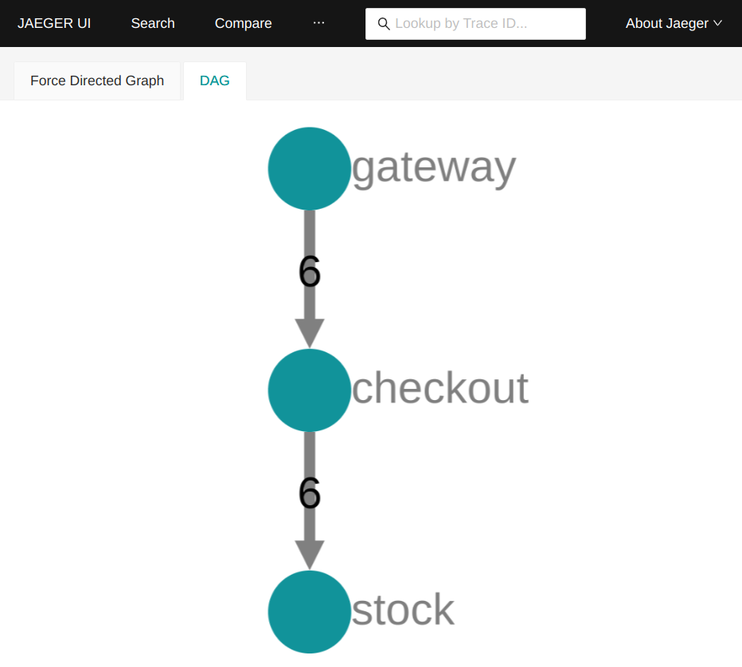

# Clone of https://github.com/pmorelli92/open-telemetry-go

Explantions in blog posts:

* https://devandchill.com/posts/2021/12/go-step-by-step-guide-for-implementing-tracing-on-a-microservices-architecture-1/2/

* https://devandchill.com/posts/2021/12/go-step-by-step-guide-for-implementing-tracing-on-a-microservices-architecture-2/2/

## Usage

1. clone repo
2. `$ docker-compose up -d`
3. generate some traffic by curling the endpoint:
`curl -v -X POST http://localhost:8081/api/checkout`
4. point your browser to http://localhost:16686/dependencies 
5. enjoy the `System Architecure` DAG

